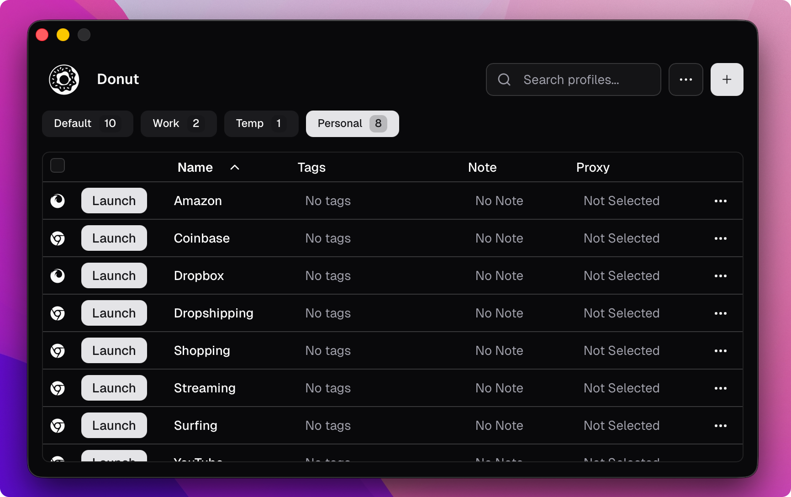

  
  <h1>Donut Browser</h1>
  <strong>A powerful anti-detect browser that puts you in control of your browsing experience. 🍩</strong>

 

  
  
  
  
  
  

## Features

- Create unlimited number of local browser profiles completely isolated from each other
- Safely use multiple accounts on one device by using anti-detect browser profiles, powered by [Camoufox](https://camoufox.com)
- Proxy support with basic auth for all browsers
- Import profiles from your existing browsers
- Automatic updates for browsers
- Set Donut Browser as your default browser to control in which profile to open links

## Download

> For Linux, .deb and .rpm packages are available as well as standalone .AppImage files.

The app can be downloaded from the [releases page](https://github.com/zhom/donutbrowser/releases/latest).

<!-- ## Supported Platforms

- ✅ **macOS** (Apple Silicon)
- ✅ **Linux** (x64)
- ✅ **Windows** (x64) -->

## Development

### Contributing

See [CONTRIBUTING.md](CONTRIBUTING.md).

## Issues

If you face any problems while using the application, please [open an issue](https://github.com/zhom/donutbrowser/issues).

## Self-Hosting Sync

Donut Browser supports syncing profiles, proxies, and groups across devices via a self-hosted sync server. See the [Self-Hosting Guide](docs/self-hosting-donut-sync.md) for Docker-based setup instructions.

## Community

Have questions or want to contribute? The team would love to hear from you!

- **Issues**: [GitHub Issues](https://github.com/zhom/donutbrowser/issues)
- **Discussions**: [GitHub Discussions](https://github.com/zhom/donutbrowser/discussions)

## Star History

<a href="https://www.star-history.com/#zhom/donutbrowser&Date">
 <picture>
   <source media="(prefers-color-scheme: dark)" srcset="https://api.star-history.com/svg?repos=zhom/donutbrowser&type=Date&theme=dark" />
   <source media="(prefers-color-scheme: light)" srcset="https://api.star-history.com/svg?repos=zhom/donutbrowser&type=Date" />
   
 </picture>
</a>

## Contributors

<!-- readme: collaborators,contributors -start -->
<table>
	<tbody>
		<tr>
            <td align="center">
                <a href="https://github.com/zhom">
                    
                     
                    <b>zhom</b>
                </a>
            </td>
            <td align="center">
                <a href="https://github.com/HassiyYT">
                    
                     
                    <b>Hassiy</b>
                </a>
            </td>
            <td align="center">
                <a href="https://github.com/JorySeverijnse">
                    
                     
                    <b>Jory Severijnse</b>
                </a>
            </td>
		</tr>
	<tbody>
</table>
<!-- readme: collaborators,contributors -end -->

## Contact

Have an urgent question or want to report a security vulnerability? Send an email to [contact@donutbrowser.com](mailto:contact@donutbrowser.com) and the team will get back to you as fast as possible.

## License

This project is licensed under the AGPL-3.0 License - see the [LICENSE](LICENSE) file for details.
