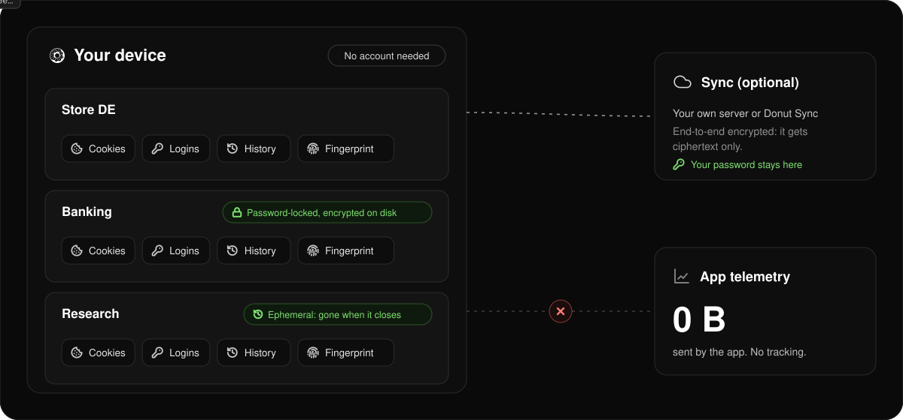

<div align="center">
  
  <h1>Donut Browser</h1>
  <strong>Open Source Anti-Detect Browser</strong>
  <br>
  <a href="https://donutbrowser.com">donutbrowser.com</a>
</div>
<br>

<p align="center">
  <a style="text-decoration: none;" href="https://github.com/zhom/donutbrowser/releases/latest" target="_blank">
  </a>
  <a style="text-decoration: none;" href="https://github.com/zhom/donutbrowser/issues" target="_blank">
    
  </a>
  <a style="text-decoration: none;" href="https://github.com/zhom/donutbrowser/blob/main/LICENSE" target="_blank">
    
  </a>
  <a style="text-decoration: none;" href="https://github.com/zhom/donutbrowser/network/members" target="_blank">
    
  </a>
</p>

<p align="center">
  
</p>

<p align="center">
  Unlimited browser profiles on one computer. Each one shows websites a different device,<br>
  keeps its own cookies, extensions and proxy, and stays on your machine.
</p>

## Keep every account separate

Websites link accounts that come from the same device, and then one ban can take all of them. In Donut, each account runs in its own profile with its own fingerprint, cookies and proxy or VPN, so every site sees a different device.



The fingerprints come from [Wayfern](https://wayfern.com), a privacy-focused Chromium fork that sets them inside the engine, not with scripts on the page.

## Your data stays on your device



- No account needed: profiles, cookies, logins and history live on your computer.
- Zero telemetry: the app sends no tracking or analytics.
- Lock a profile with a password, or make it ephemeral so that nothing is left when it closes.
- Sync is optional and end-to-end encrypted with a password only you know. Use Donut Sync or [run your own server](https://donutbrowser.com/docs/self-hosting).

## Automate with code or with AI agents



Start any profile from the local REST API on `127.0.0.1:10108`, then connect Playwright, Puppeteer or Selenium to it over CDP. Or connect Claude, Cursor, Codex or another MCP client over remote MCP, and watch what each agent does. Browser automation and remote MCP come with the paid plans. See the [quickstart](https://donutbrowser.com/docs/quickstart), [Playwright with Wayfern](https://donutbrowser.com/docs/wayfern) and [MCP](https://donutbrowser.com/docs/mcp) guides.

## Features

- Unlimited browser profiles: each fully isolated with its own fingerprint, cookies, extensions, and data
- Anti-detect Chromium engine: powered by [Wayfern](https://wayfern.com), a privacy-focused Chromium fork whose fingerprint spoofing is not detected by Cloudflare, reCaptcha v3, or other browser fingerprinting and anti-bot services
- DNS AdBlocker: block ads, trackers, and other unwanted content with per-profile DNS blocking
- Proxy support: HTTP, HTTPS, SOCKS4, SOCKS5 per profile, with dynamic proxy URLs
- VPN support: WireGuard configs per profile
- REST API & remote MCP: a local REST API and a remote [Model Context Protocol](https://modelcontextprotocol.io) server for Claude, Cursor, automation tools and custom workflows
- Profile groups: organize profiles and apply bulk settings
- Import profiles: migrate from Chrome, Edge, Brave, or other Chromium browsers
- Cookie & extension management: import/export cookies, manage extensions per profile
- Default browser: set Donut as your default browser and choose which profile opens each link
- Cloud sync: sync profiles, proxies, and groups across devices (self-hostable)
- E2E encryption: optional end-to-end encrypted sync with a password only you know
- Zero telemetry: no tracking or device fingerprinting

## Install

<!-- install-links-start -->
### macOS

| | Apple Silicon | Intel |
|---|---|---|
| **DMG** | [Download](https://github.com/zhom/donutbrowser/releases/download/v0.32.0/Donut_0.32.0_aarch64.dmg) | [Download](https://github.com/zhom/donutbrowser/releases/download/v0.32.0/Donut_0.32.0_x64.dmg) |

Or install via Homebrew:

```bash
brew install --cask donut
```

### Windows

[Download Windows Installer (x64)](https://github.com/zhom/donutbrowser/releases/download/v0.32.0/Donut_0.32.0_x64-setup.exe) · [Portable (x64)](https://github.com/zhom/donutbrowser/releases/download/v0.32.0/Donut_0.32.0_x64-portable.zip)

### Linux

| Format | x86_64 | ARM64 |
|---|---|---|
| **deb** | [Download](https://github.com/zhom/donutbrowser/releases/download/v0.32.0/Donut_0.32.0_amd64.deb) | [Download](https://github.com/zhom/donutbrowser/releases/download/v0.32.0/Donut_0.32.0_arm64.deb) |
| **rpm** | [Download](https://github.com/zhom/donutbrowser/releases/download/v0.32.0/Donut-0.32.0-1.x86_64.rpm) | [Download](https://github.com/zhom/donutbrowser/releases/download/v0.32.0/Donut-0.32.0-1.aarch64.rpm) |
| **AppImage** | [Download](https://github.com/zhom/donutbrowser/releases/download/v0.32.0/Donut_0.32.0_amd64.AppImage) | [Download](https://github.com/zhom/donutbrowser/releases/download/v0.32.0/Donut_0.32.0_aarch64.AppImage) |
<!-- install-links-end -->

Or install via package manager:

```bash
curl -fsSL https://donutbrowser.com/install.sh | sh
```

<details>
<summary>Troubleshooting AppImage</summary>

If the AppImage segfaults on launch, install libfuse2 (`sudo apt install libfuse2` / `yay -S libfuse2` / `sudo dnf install fuse-libs`), or bypass FUSE entirely:

```bash
APPIMAGE_EXTRACT_AND_RUN=1 ./Donut.Browser_x.x.x_amd64.AppImage
```

If that gives an EGL display error, add `WEBKIT_DISABLE_DMABUF_RENDERER=1` or `GDK_BACKEND=x11` to the command above. If issues persist, the .deb and .rpm packages are more reliable.

</details>

### Flatpak and Snap

Releases include an x86_64 Flatpak bundle and a Snap, built from the `.deb` and tested in their sandboxes by the [Linux Packages](https://github.com/zhom/donutbrowser/actions/workflows/linux-packages.yml) workflow. Download `Donut_*_x86_64.flatpak` or `Donut_*_amd64.snap` from the [releases](https://github.com/zhom/donutbrowser/releases) (the nightly has them already) and install it:

```bash
flatpak install --user Donut_*_x86_64.flatpak
sudo snap install --dangerous Donut_*_amd64.snap
```

The Snap leaves the microphone, the camera and the keyring (used by profile import) disconnected until you run `sudo snap connect donutbrowser:audio-record`, `donutbrowser:camera` or `donutbrowser:password-manager-service`. The Flatpak cannot change the default browser, so choose Donut in your system settings instead.

### Nix

```bash
nix run github:zhom/donutbrowser#release-start
```

## Self-Hosting Sync

Run your own sync server to sync profiles, proxies, and groups across devices for free. See the [Self-Hosting Donut Sync guide](https://donutbrowser.com/docs/self-hosting) for Docker-based setup instructions.

## Contributing

Donut Browser is built by the people who use it, and plenty of the most useful help involves no code at all.

- Tell other people about Donut. Word of mouth is how most users find the project, so talking about it is a real contribution.
- Report bugs and request features in [GitHub Issues](https://github.com/zhom/donutbrowser/issues).
- Answer questions in [GitHub Discussions](https://github.com/zhom/donutbrowser/discussions).
- Fix and improve translations in `src/i18n/locales`.
- Write code. Start with [CONTRIBUTING.md](CONTRIBUTING.md).
- Star the repo so more people see it.

## Star History

<a href="https://gitdebt.com/zhom/donutbrowser?ref=readme">
  <picture>
    <source media="(prefers-color-scheme: dark)" srcset="https://api.gitdebt.com/api/repos/zhom/donutbrowser/chart.svg?theme=dark&animate=1" />
    
  </picture>
</a>

## Contributors

<a href="https://gitdebt.com/zhom/donutbrowser?ref=readme">
  <picture>
    <source media="(prefers-color-scheme: dark)" srcset="https://api.gitdebt.com/api/repos/zhom/donutbrowser/stats/contributors.svg?theme=dark&animate=1" />
    
  </picture>
</a>

## Contact

For urgent questions or security vulnerability reports, email [contact@donutbrowser.com](mailto:contact@donutbrowser.com).

## License

This project is licensed under the AGPL-3.0 License. See the [LICENSE](LICENSE) file for details.
